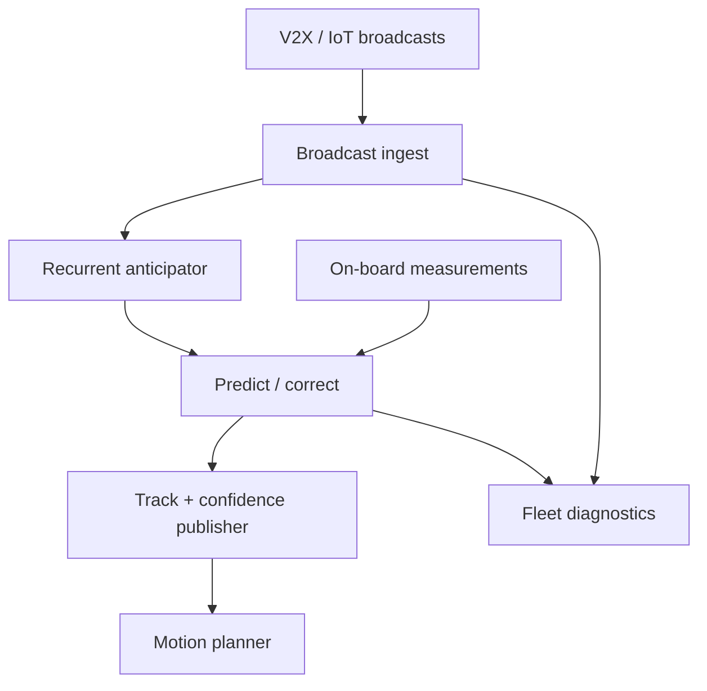

# GhostLane

**Source:** `ai-in-iot/1801.01444v2/`
**Domain:** `ai-iot`
**One-liner:** A lightweight motion-anticipation service for V2X and mobile robots that keeps predicting object trajectories when IoT broadcasts arrive late, drop, or shift, so mission-critical agents do not go blind between packets.
**Wedge:** Autonomous vehicle stacks and mobile-robot fleets using infrastructure/V2V object broadcasts in dense urban RF environments where 100 ms latency already equals meters of travel.
**Positioning:** Anticipation under unreliable IoT perception. Classical on-board lidar/camera stacks are line-of-sight limited; wireless object broadcast extends range around corners — but only if the stack can survive latency, miss noise, and measurement shift. GhostLane productizes RNN + Kalman-style predict/correct as an edge service for that failure mode.

## Market research synthesis

### Thesis from source

IoT-era connectivity lets mobile agents perceive beyond line-of-sight by consuming broadcast object state from other devices and infrastructure — higher update potential than 10–50 Hz lidars/cameras, with 5G promising millisecond-class latency. That promise collapses in crowded or reflective environments: latency spikes, packet loss (“miss noise”), and sensor measurement shift (“shift noise”) make raw IoT perception unreliable. At 150 km/h, 100 ms of latency corresponds to about 4.17 m of travel — enough for a wrong decision at a blind intersection.

The paper proposes Deep Anticipation: recurrent networks learn environment dynamics and object interactions on an occupancy-style representation, while Kalman-like prediction/correction teaches the system when to trust measurement versus prediction. Unlike trackers that only handle occlusion or pepper-and-salt noise, the method targets missing broadcasts and shifted locations, and unlike social-pooling pedestrian trackers that follow objects individually, it models interactions on the scene. The resulting architecture is intentionally lightweight — on the order of a few thousand trainable parameters (≈3906 for the cited KGA variant), about 18 ms per frame, roughly 10% of the parameters and 3× faster than heavier convolutional-recurrent baselines — making it suitable for resource-limited mobile applications.

The product is a safety-adjacent anticipation sidecar: ingest IoT object broadcasts, maintain belief under dropouts, emit anticipated trajectories and confidence for planners, and expose noise-mode diagnostics to fleet engineers.

### Buyer & economic model

- **Primary buyer:** Director of Autonomous Systems / ADAS perception lead at AV stacks, robotaxi, or AMR (autonomous mobile robot) fleets; smart-intersection OEMs as a channel.
- **Users:** perception engineers, motion planners, fleet safety ops, RF/network engineers.
- **Budget owner / value metric:** autonomy safety and compute budget. Value metric is reduction in planner blind intervals during packet loss and false collision/near-miss rate attributable to stale IoT tracks.
- **Competing status quo:** drop missing objects immediately, hold last pose, or naive constant-velocity coasting without interaction-aware correction.

### Domain constraints

- **Regulatory / trust / safety:** outputs are decision-support for planners; safety cases must define confidence thresholds and fail-safe behavior when anticipation entropy is high.
- **Data sensitivity:** shared object broadcasts may include vulnerable road user positions; retention and sharing agreements are regulated.
- **Change-management realities:** stacks will not replace lidar; GhostLane must sit beside existing perception with clear fusion semantics.

## Business requirements

- BR-1: The system must continue publishing anticipated object states through configured miss durations, with confidence that decays honestly rather than silently freezing stale poses.
- BR-2: Latency, miss, and shift noise modes must be detectable and reportable as separate operational metrics.
- BR-3: Interaction-aware anticipation must be available — objects cannot be coasted independently when the trained model expects coupled motion.
- BR-4: End-to-end anticipation latency on target mobile hardware must stay within the published real-time budget (tens of milliseconds class).
- BR-5: Model footprints must remain small enough for in-vehicle/edge robot deployment without datacenter offload for the hot path.
- BR-6: Planners must receive calibrated confidence/uncertainty so they can slow, stop, or widen envelopes when belief is weak.
- BR-7: Fusion adapters must define precedence between on-board sensors and IoT broadcasts without double-counting objects.
- BR-8: Safety-critical deployments must support a fail-safe mode that marks IoT-origin tracks untrusted when RF health collapses beyond policy.
- BR-9: Training/evaluation must include synthetic and real noise profiles that mimic IoT communication degradations, not only clean tracks.
- BR-10: Fleet ops must see per-segment RF degradation correlated with anticipation reliance, so network fixes are prioritized.
- BR-11: Audit logs must retain anticipation inputs/outputs for incident replay within a defined window.
- BR-12: Commercial packaging must align to vehicle/robot endpoints and intersections covered, with clear safety-responsibility boundaries in contracts.

## User stories

Canonical user stories live in sibling [USER_STORIES.md](USER_STORIES.md).

## System design

### Overview

GhostLane consumes time-stamped object broadcasts and optional local measurements, maintains a recurrent belief over scene occupancy/dynamics, applies predict/correct updates, and emits anticipated trajectories with confidence to planning/fusion. A fleet service monitors RF health, model versions, and incident replay. Training pipelines inject miss/shift/latency noise so released models are graded for IoT reality.

### Actors & boundaries

- **Actors:** vehicles/robots, roadside units, GhostLane edge runtime, planners, fleet ops, RF engineering.
- **Trust boundary:** anticipation outputs are advisory tracks with provenance (measured vs predicted). Safety authority remains with the vehicle stack’s planner and safety monitor.
- **Human-in-the-loop points:** deployment of new model profiles, raising/lowering fail-safe thresholds, corridor remediation decisions.

### Core capabilities

1. **Broadcast ingestion** — V2X/IoT object state normalization.
2. **Recurrent dynamics belief** — interaction-aware scene anticipation.
3. **Kalman-style correction** — biased trust between prediction and measurement.
4. **Noise-mode diagnostics** — latency/miss/shift telemetry.
5. **Confidence publishing** — uncertainty to planners.
6. **Fusion adapters** — conflict resolution with on-board perception.
7. **Fail-safe policy** — degrade IoT trust under RF collapse.
8. **Incident replay** — buffered input/output for safety review.

### Conceptual data

- **Primary entities:** Agent, ObjectBroadcast, SceneBelief, AnticipatedTrack, NoiseReport, FusionPolicy, ModelProfile, IncidentReplay.
- **Critical events:** broadcast received, packet missed, prediction emitted, correction applied, confidence collapsed, fail-safe entered, incident stored.
- **Retention / audit needs:** short horizon buffers for hot path; longer incident replay windows for safety; minimize storage of identifiable VRU trajectories outside policy.

### Integrations (conceptual)

- **Systems of record:** autonomy stack track fusion, fleet safety case tooling, RSU management.
- **Upstream signals:** V2X messages, GPS/IMU, optional lidar/camera tracks, RF modem health.
- **Downstream actions:** planner constraints, driver/HMI warnings, infrastructure tickets.

### High-level architecture

### Success metrics

- **Leading:** p95 anticipation latency; parameter footprint on target ECU; share of frames served predicted-vs-measured.
- **Lagging:** blind-interval duration during loss events; near-miss rate in degraded RF corridors; false-positive hard brakes from shift noise; safety-case audit pass rate.

## OpenAPI skeleton

Canonical HTTP surface lives in sibling [openapi.yaml](openapi.yaml). Summary:

- **Base path:** `/v1/...`
- **Auth:** `X-API-Key` for vehicles/RSUs; Bearer JWT for fleet operators.
- **Resource groups:** Agents, Broadcasts, Tracks, NoiseReports, FusionPolicies, ModelProfiles, Incidents.
