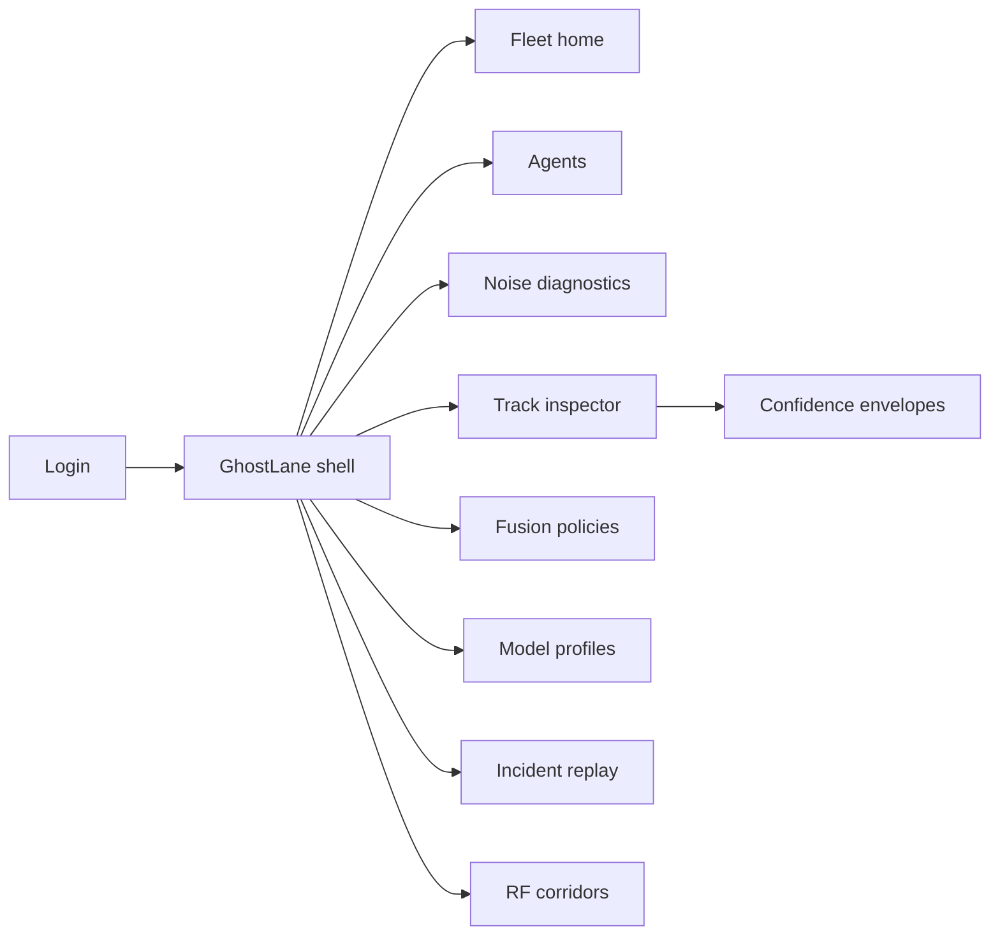
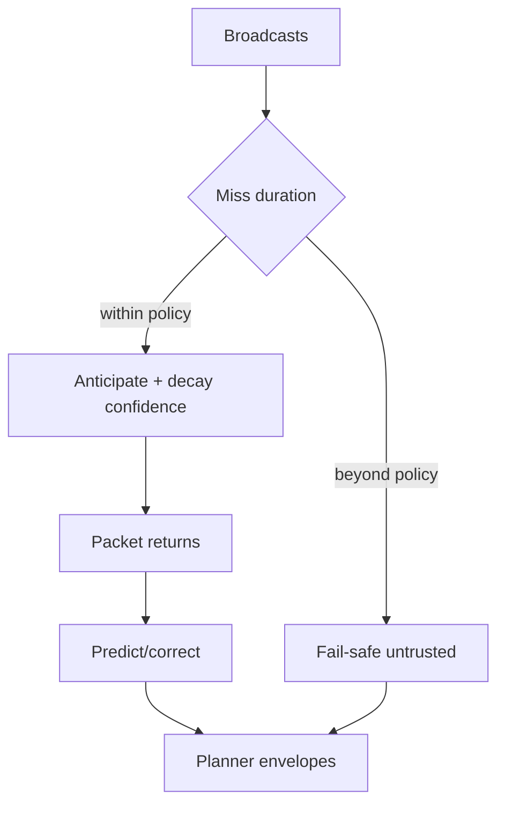

# GhostLane — Web app

**Product:** [PRODUCT.md](./PRODUCT.md)
**Primary surface:** Fleet anticipation ops console (noise diagnostics, fusion policy, model profiles, incident replay)
**Secondary surfaces:** Planner confidence inspector (read-only API-backed view); RF corridor remediation board
**Design thesis:** GhostLane is anticipation under unreliable IoT perception — a ghost lane of belief between packets, not a lidar replacement dashboard. The UI metaphor is a blind-intersection control strip: cool night-blue on charcoal, predicted tracks drawn as dashed “ghost” polylines that fade with honest confidence decay, and latency/miss/shift as three distinct noise instruments. Brand sits on fail-safe and incident screens so safety ops know which sidecar filled the meters between dropped broadcasts — never a silently frozen last pose.

## UX research synthesis

### Category peers (best-in-class)

- **Applied Intuition / Foxglove / RVizWeb-style autonomy viz:** Track overlays with provenance and uncertainty ellipses. Steal: measured vs predicted styling and envelope display; reject full 3D sim as the only home for fleet RF ops.
- **Cruise / Waymo-style fleet safety tools (public patterns):** Incident replay with timeline scrub of sensor health. Steal: miss/latency timeline joined to model outputs; reject opaque “AI confidence” without noise-mode split.
- **Cohda / Commsignia V2X monitoring:** RSU/packet health histograms by corridor. Steal: RF degradation ↔ anticipation reliance join; reject modem-only views that ignore planner impact.
- **Motional / Aptiv track-fusion config UIs:** Precedence between sources. Steal: fusion policy templates (IoT-primary at blind intersections vs lidar-primary open road); reject double-count-prone merge without provenance.

### Patterns to adopt / reject

- **Adopt:** Honest confidence decay during misses; separate latency/miss/shift metrics; interaction-aware scene view (not independent coast dots); fail-safe “IoT untrusted” flag; lightweight model profile pins per vehicle class; incident replay buffers; fusion precedence templates.
- **Reject:** Hold-last-pose as default viz; single blended “noise %”; purple autonomy glow; editable track positions; video-wall vanity without RF correlation; chatbot safety case.

### Trust, density, and workflow constraints from PRODUCT.md

Outputs are decision-support: planners need calibrated uncertainty and degraded flags (BR-6, BR-8). Hot path must stay tens-of-ms and small-footprint on ECU (BR-4, BR-5). Safety cases demand fail-safe when RF collapses (BR-8). Fleet must correlate per-segment RF with anticipation reliance (BR-10). Incident replay retains inputs/outputs for a window (BR-11). Contracts need clear safety-responsibility boundaries (BR-12) — UI must never imply GhostLane is the vehicle safety authority.

## Information architecture

### Nav model

### Roles → default home

| Role | Default home | Why |
|------|--------------|-----|
| Perception engineer | Track inspector + models | Anticipated tracks under miss/shift (BR-1, BR-3) |
| Motion planner | Confidence inspector | Uncertainty envelopes and degraded flag (BR-6, BR-8) |
| Fleet safety operator | Incident replay | Separate RF faults from model faults (BR-11) |
| Network / RF engineer | RF corridors + noise | Loss/latency joined to reliance (BR-2, BR-10) |
| Platform admin | Fusion policies + model pins | Consistent site behavior (BR-7) |

### Cross-links to OpenAPI resources

| Nav area | OpenAPI tags / resources |
|----------|---------------------------|
| Vehicles / robots | Agents |
| V2X object ingest health | Broadcasts |
| Anticipated outputs | Tracks |
| Latency / miss / shift | NoiseReports |
| Source precedence | FusionPolicies |
| ECU-fit versions | ModelProfiles |
| Safety replay | Incidents |

## Screen inventory

### Fleet home

- **Purpose:** Answer “where are we coasting on ghosts, and is RF making us?” in one composition.
- **Entry:** Safety/ops login.
- **Layout regions:** Brand + fleet scope; blind-interval strip during loss events; noise-mode triad (latency/miss/shift); fail-safe engagements; corridor hotspots; model footprint health.
- **Primary actions:** Open worst corridor; open active fail-safe agents; start incident scrub.
- **Empty / loading / error:** Empty = register agents + attach model profile; telemetry gap = amber.
- **BR / story ties:** BR-2, BR-8, BR-10.

### Agents

- **Purpose:** Registry of vehicles/robots with pinned model profile and fusion template.
- **Entry:** Nav → Agents.
- **Layout regions:** Agent table (class, profile, fusion policy, RF health, fail-safe state); detail with hot-path latency budget.
- **Primary actions:** Pin profile; assign fusion template; force fail-safe drill.
- **Empty / loading / error:** Unpinned class = block production flag.
- **BR / story ties:** BR-5, BR-12; platform admin stories.

### Noise diagnostics

- **Purpose:** Report latency, miss, and shift as separate operational metrics — not one blended score.
- **Entry:** RF engineer default; fleet home.
- **Layout regions:** Triad charts; per-segment histograms; anticipation reliance %; staging loss simulator controls.
- **Primary actions:** Simulate higher loss on route; open remediation ticket; compare before/after.
- **Empty / loading / error:** Missing modem health = partial banner.
- **BR / story ties:** BR-2, BR-9, BR-10; RF engineer stories.

### Track / confidence inspector

- **Purpose:** Show anticipated trajectories with measured vs predicted provenance and uncertainty envelopes.
- **Entry:** Perception/planner roles.
- **Layout regions:** Scene occupancy-style map; ghost dashed tracks; confidence decay meter during miss; interaction coupling hint; planner degraded flag.
- **Primary actions:** Pin object; export planner sample; toggle on-board vs IoT precedence overlay.
- **Empty / loading / error:** High entropy = fail-safe chrome, not fake certainty.
- **BR / story ties:** BR-1, BR-3, BR-6; planner stories.

### Fusion policies

- **Purpose:** Define precedence between on-board sensors and IoT broadcasts without double-counting.
- **Entry:** Admin; agent assign.
- **Layout regions:** Template list (blind intersection IoT-primary, highway lidar-primary); conflict rules; double-count guards.
- **Primary actions:** Create template; assign to segment/agent; validate.
- **Empty / loading / error:** Ambiguous precedence = block publish.
- **BR / story ties:** BR-7.

### Model profiles

- **Purpose:** Keep footprints small and pin versions per vehicle class — no silent unfit share.
- **Entry:** Perception engineer.
- **Layout regions:** Profile table (params footprint, ms/frame, noise-eval grades); class compatibility; release notes for miss/shift training.
- **Primary actions:** Publish; pin; retire; compare vs heavier baseline budget.
- **Empty / loading / error:** Over ECU budget = coral gate.
- **BR / story ties:** BR-4, BR-5, BR-9.

### Incident replay

- **Purpose:** Scrub anticipation inputs/outputs with miss/latency timeline for safety review.
- **Entry:** Safety operator default.
- **Layout regions:** Incident list; timeline scrubber; RF vs model fault tags; export for safety case.
- **Primary actions:** Tag root cause; share with RF; retain per policy window.
- **Empty / loading / error:** Buffer expired = retention message.
- **BR / story ties:** BR-11; safety operator stories.

### RF corridors

- **Purpose:** Prioritize infrastructure fixes where low confidence recurs.
- **Entry:** From fleet home hotspot.
- **Layout regions:** Corridor map; reliance vs packet loss; ticket status; RSU health.
- **Primary actions:** Demand infrastructure fix; schedule staging sim; attach incidents.
- **Empty / loading / error:** No geo = tabular fallback.
- **BR / story ties:** BR-10.

### Fail-safe policy

- **Purpose:** Mark IoT-origin tracks untrusted when RF health collapses beyond policy.
- **Entry:** From agents or safety.
- **Layout regions:** Thresholds; behavior (untrusted flag, planner conservative mode); drill history; contract boundary note (“planner remains authority”).
- **Primary actions:** Save; drill; audit.
- **Empty / loading / error:** Missing thresholds = cannot enable IoT-primary fusion.
- **BR / story ties:** BR-8, BR-12.

## Key flows

1. **Survive broadcast miss** — packets drop → predict with decaying confidence → correct on return → planner sees envelopes; failure: entropy high → fail-safe untrusted (BR-1, BR-8).

2. **Shift-noise correction** — jittered positions → correction trust measurement vs prediction → avoid ghost collisions (BR-2, BR-3).

3. **Corridor remediation** — recurring low confidence → RF histograms → ticket → staging loss sim → re-validate fail-safe (BR-10, BR-9).

4. **Pin model per class** — publish lightweight profile → ECU budget gate → pin robot vs highway AV separately (BR-5).

5. **Incident review** — near-miss → replay I/O + noise timeline → tag RF vs model → export (BR-11).

## Design system

### Tokens (CSS variables)

- `--color-ink: #E6EDF5` — text
- `--color-night-950: #070A10` — ground
- `--color-night-900: #101622` — panels
- `--color-night-700: #2A3448` — rules
- `--color-ghost: #7EB6FF` — predicted track / ghost lane
- `--color-measured: #9FE870` — measured update
- `--color-amber: #E0A83A` — miss / elevated entropy
- `--color-coral: #E25B4C` — fail-safe / untrusted
- `--color-shift: #C084FC` — avoid purple glow branding; use sparingly only as shift-noise series in charts, never as app theme
- `--color-steel: #8494A8` — secondary
- `--color-brand: #A8C7E8` — GhostLane mark
- `--font-display: "Space Grotesk", sans-serif` — fleet titles
- `--font-mono: "IBM Plex Mono", monospace` — timestamps, track ids
- `--space-1`…`--space-8`: 4px scale
- `--radius-sm: 4px`; `--radius-md: 8px`
- `--motion-ghost: 240ms ease-out` — predicted polyline fade
- `--motion-miss: 200ms ease-in-out` — confidence decay
- `--motion-failsafe: 160ms ease-out` — coral engage
- Atmosphere: night road vignette with faint dashed lane ghosts; no neon cyberpunk grid overload; app chrome stays blue-steel, not purple-on-white.

### Typography & brand

- Display for corridor names and fail-safe banners; mono for packet timelines.
- Brand on incident and fail-safe views; login headline (“Belief between packets”).
- Always show safety-responsibility footnote on planner-facing views.

### Do / don’t

- **Do:** Decay confidence visibly; split noise modes; dashed predicted vs solid measured; fail-safe explicit.
- **Don’t:** Freeze last pose as truth; blend noise into one score; imply GhostLane is the safety monitor of record; purple AI theme.

### Accessibility & domain trust cues

- Predicted vs measured encoded by stroke pattern + label.
- Live regions for fail-safe enter/exit.
- Focus: noise → tracks → fail-safe → incident.

## Component patterns

- **GhostTrackPolyline** — dashed anticipated path with opacity∝confidence.
- **NoiseModeTriad** — latency / miss / shift instruments.
- **ConfidenceEnvelope** — planner uncertainty region.
- **IotDegradedFlag** — explicit perception degraded state.
- **FusionPrecedenceTemplate** — IoT-primary vs lidar-primary.
- **ModelFootprintChip** — params and ms/frame vs ECU budget.
- **IncidentScrubTimeline** — RF + anticipation aligned.
- **FailSafeBanner** — IoT tracks marked untrusted.

## Out of scope for v1 web

- Full autonomy stack planner; lidar labeling suite; V2X stack implementation; consumer navigation app; legal safety-case authoring tool beyond export hooks; datacenter-only heavy ConvRNN training UI as primary ops.
